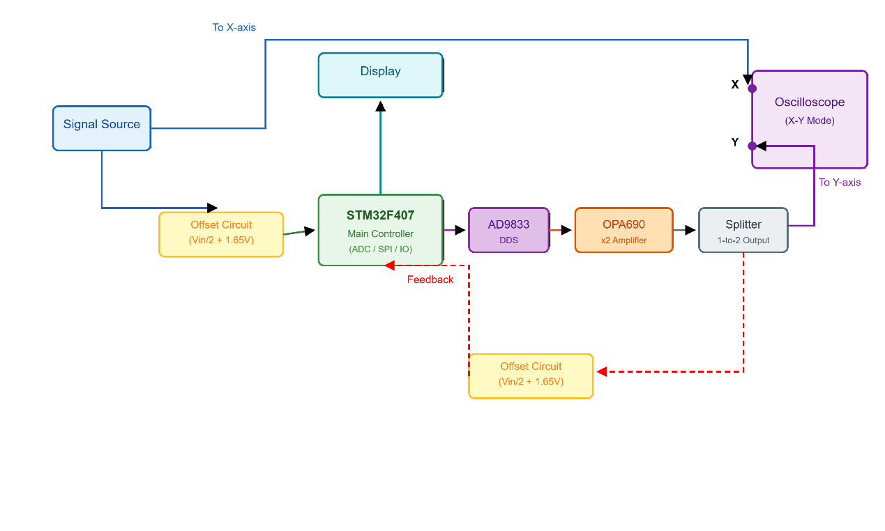

# STM32F407 李萨如图形数字锁相控制器（2026电赛F题前四问代码及说明）

本项目使用 **STM32F407VGT6 + AD9833**，测量外部正弦信号 X，并生成频率、相位和幅度受控的正弦信号 Y。示波器工作在 X-Y 模式时，可稳定显示对角线、圆和“∞”形李萨如图形。

> 本仓库只保留已经完成并验证的前四问，不包含第五问的摄像头识别、扫频和视觉闭环代码。

## 实现功能

| 模式 | 输出关系 | 示波器图形 |
|---|---|---|
| 第一问 | fY=fX，φY-φX=0°，Y=4 Vpp | 8×8 div 正斜线 |
| 第二问 | fY=fX，φY-φX=90°，Y=4 Vpp | 直径 8 div 的圆 |
| 第三问 | fY=2fX，φY-2φX=0°，Y=4 Vpp | 上下、左右对称的“∞”形 |
| 第四问 | 图形关系不变，Y=1/2/3/4 Vpp | Y方向 2/4/6/8 div |

输入频率范围为 1 kHz～100 kHz。第三问中 Y 的最高频率可达到 200 kHz。

## 技术亮点

- TIM8 统一触发 ADC1/ADC2 双重规则同步采样
- DMA 将 X/Y 两路 12 位数据打包写入同一缓冲区
- 8192 点 FFT、Hann 窗和谱峰二次插值完成启动测频
- 带迟滞的多周期过零插值降低 FFT 频点跳变
- 正弦最小二乘拟合获得短帧幅值和相位
- 快速相位环 + 慢速频率环构成数字 PLL/FLL
- 直接频差粗调与相位斜率精调结合，避免假锁定
- 连续窗口锁定、失锁释放和输入变频自动重捕获
- 对模拟前端和示波器测量点引入的相位误差进行频率相关标定

## 系统结构



图中蓝色路径为输入信号与示波器 X 轴通道，紫色路径为 DDS 输出与示波器 Y 轴通道，红色虚线为 Y 路闭环反馈。X、Y 两路反馈在进入 STM32 ADC 前均经过 `Vin/2 + 1.65 V` 的衰减偏置处理。

```text
信号源 X ──┬──> 示波器 X
           └──> X/2 + 1.65 V ──> ADC2(PA1)

ADC1/ADC2 + DMA
       │
       ├──> FFT / 过零频率估计
       ├──> X/Y 正弦拟合与相位关系计算
       └──> 数字 PLL/FLL
                    │
                    v
             AD9833 + 数字增益
                    │
                 外部运放
                    ├──> 示波器 Y
                    └──> Y/2 + 1.65 V ──> ADC1(PC5)
```

## 代码目录

```text
firmware/
├─ app/       前四问模式、频率/相位双闭环和状态管理
├─ dsp/       双通道采样、FFT、过零测频和正弦拟合
├─ drivers/   AD9833及模块数字增益控制
├─ hmi/       TJC/Nextion串口屏交互
└─ example/   CubeMX外设配置样例和main调用示例
docs/
├─ algorithm.md       算法演进与关键问题
├─ hardware-wiring.md 硬件接线
└─ github-upload.md   GitHub新手上传方法
```

## 关键入口

```c
Question_1();
Question_2();
Question_3();
Question_4(QUESTION_4_SHAPE_DIAGONAL, 4U);
Question_4(QUESTION_4_SHAPE_CIRCLE, 2U);
Question_4(QUESTION_4_SHAPE_INFINITY, 3U);
```

第四问实测幅度映射：

| 目标输出 | AD9833 amp |
|---:|---:|
| 1 Vpp | 35 |
| 2 Vpp | 70 |
| 3 Vpp | 105 |
| 4 Vpp | 141 |

## 实测结果

在100 kHz、4 Vpp正弦输入的典型工况下，使用约1.02 MSPS双ADC同步采样，并通过USART2连续记录闭环状态，得到以下结果：

| 测试项目 | 实测结果 |
|---|---:|
| 从启动测频到进入锁定 | 约1 s |
| 锁定后的闭环相位残差 | 稳定保持在±0.07°以内 |
| 输入与输出频率关系 | 1:1和2:1模式均可闭环跟踪 |
| Y输出幅度档位 | 1、2、3、4 Vpp |
| 对应示波器Y轴范围 | 2、4、6、8 div |

其中约1.69 Hz的DDS指令偏移用于补偿独立时钟源之间的实际频差，使相位不再持续漂移。±0.07°表示经过同步采样和模拟链路标定后，控制器计算得到的闭环相位残差，不等同于未经校准的示波器绝对相位测量精度。

同频模式还根据实测结果加入频率相关的模拟链路相位补偿：1 kHz处约0°，100 kHz处约2.5°，在区间内采用线性插值。

## 使用说明

1. 使用 STM32CubeMX 配置双 ADC、DMA、TIM8、GPIO、SPI和UART，具体见 [硬件接线](docs/hardware-wiring.md)。
2. 将 `firmware/app`、`firmware/dsp`、`firmware/drivers` 加入工程。
3. 如需串口屏，再加入 `firmware/hmi`。
4. 参考 `firmware/example/main_front_four.c` 完成初始化和模式调用。
5. 根据实际晶振、模拟前端和AD9833模块重新标定采样时钟、相位补偿和amp映射。

## 工程规模

前四问约 4000 行嵌入式 C 核心代码，包括约 1500 行信号采集与频相测量、约 1100 行频率/相位闭环与模式控制，以及约 1400 行驱动、串口屏、调试标定和系统集成代码。

## 依赖与说明

- MCU：STM32F407VGT6
- DDS：AD9833模块（带数字增益控制）
- 固件库：STM32CubeF4 HAL
- 开发环境：STM32CubeMX + Keil MDK-ARM
- 仓库未重复分发STM32 HAL/CMSIS厂商库

这是竞赛原型的代码归档，不同PCB、时钟源和模拟链路需要重新标定。授权与第三方代码说明见 [NOTICE.md](NOTICE.md)。
