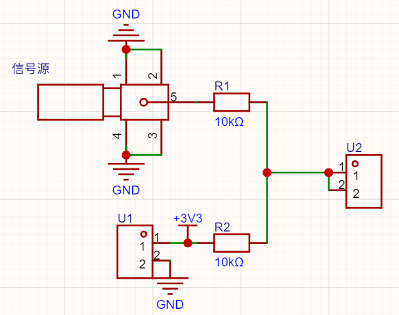
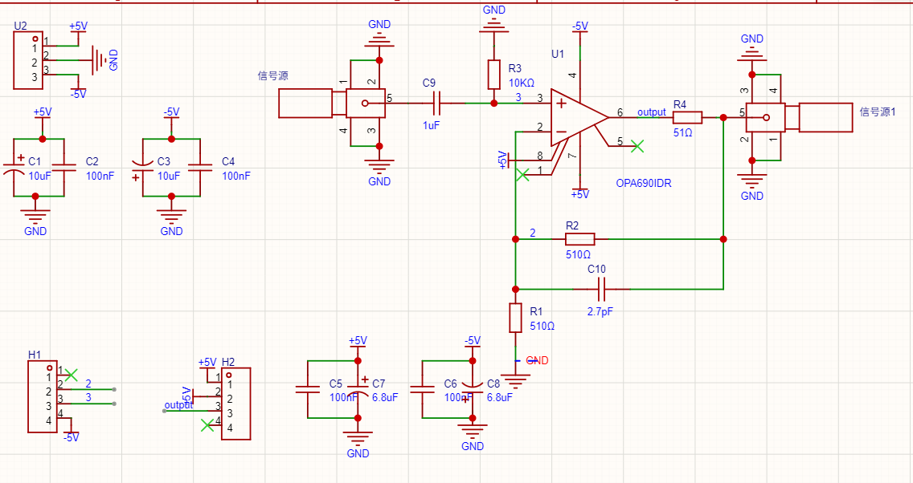
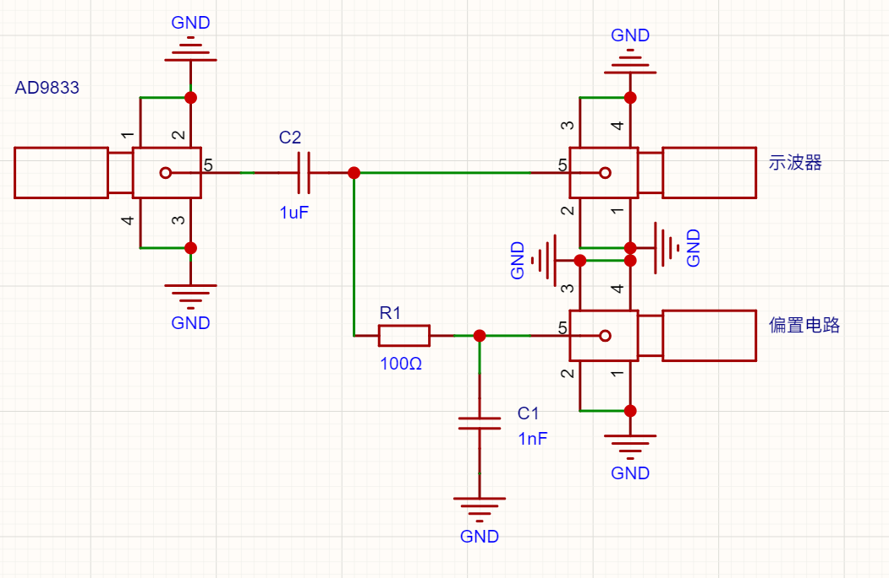

# 硬件接线

## 1. X/Y同步反馈

| 信号 | STM32引脚 | 外设 | 处理方式 |
|---|---|---|---|
| X输入采样 | PA1 | ADC2_IN1 | X/2 + 1.65 V |
| Y反馈采样 | PC5 | ADC1_IN15 | Y/2 + 1.65 V |

X、Y原始信号均为双极性正弦波，不能直接送入0～3.3 V ADC。两路使用尽量一致的纯电阻衰减和偏置网络：

```text
VADC = Vin / 2 + 1.65 V
```



图中两只10 kΩ电阻构成等权叠加：一路接原始信号，另一路接3.3 V基准，因此得到 `Vin/2 + 1.65 V`。X路与Y反馈路应使用同阻值、同类型电阻，并尽量采用对称布线，以减小频率相关相位差。

4 Vpp输入即 -2～+2 V，转换后约为0.65～2.65 V。上电前应使用示波器确认ADC端不会低于0 V或高于3.3 V。

## 2. AD9833与数字增益

| 模块信号 | STM32引脚 |
|---|---|
| FSYNC | PD12 |
| SCLK | PD10 |
| SDATA | PD8 |
| 数字增益CS | PB14 |
| GND | STM32公共地 |

当前驱动采用GPIO模拟串行时序。不同AD9833模块的引脚名称和增益芯片可能不同，接线前必须核对模块原理图。

## 3. 输出链路

```text
AD9833输出 -> 外部运放 -> Y节点
                         ├─> 示波器Y轴
                         └─> 衰减偏置网络 -> PC5
```

X信号直接分一路送示波器X轴，另一路经过衰减偏置送PA1。所有模块、信号源和示波器必须共地。

### OPA690放大级



报告中的实物方案采用OPA690同相放大，反馈与接地电阻均为510 Ω，对应约2倍电压增益；输出串联51 Ω用于隔离走线及容性负载。实际焊接时应以最终PCB和实测幅度为准。

### 输出分路与反馈



Y节点一分为二：示波器支路保持原始输出，反馈支路串联100 Ω并以1 nF对地抑制瞬态毛刺，再进入与X路一致的衰减偏置网络。该RC会引入频率相关相移，最终需要由软件标定补偿。

## 4. 串口

| 用途 | STM32串口 | TX/RX |
|---|---|---|
| TJC/Nextion串口屏 | USART1 | PA9 / PA10 |
| 控制器调试日志 | USART2 | PD5 / PD6 |

调试日志默认约500 ms发送一次。只接收日志时，通常只需将PD5连接USB转串口模块RX，并连接公共GND。

## 5. CubeMX关键配置

- ADC1和ADC2：12位，双重规则同步模式
- 主ADC：ADC1；从ADC：ADC2
- 外部触发：TIM8 TRGO
- DMA：ADC1对应DMA2，32位打包缓冲区，Normal模式
- TIM8：配置为约1.02 MSPS采样触发
- USART2：开启发送中断，用于非阻塞调试输出
- GPIO：PD8、PD10、PD12、PB14配置为推挽输出

实际工程参数可参考 `firmware/example` 中保留的CubeMX生成文件。
